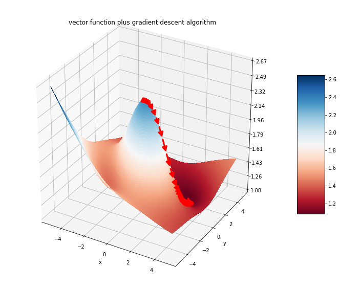

# CS207 Group 4: Final Project Repo

 

## *`autograd` (subject to change)*

# image generated with `autograd` 

## Members
* Paxton Maeder-York
* Adam Nitido
* Dylan Randle
* Simon Sebbagh

Please see `docs` for useful information.
