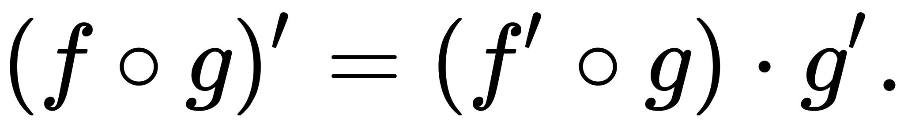

Background
==========

The basic idea that underpins the AD algorithm is the chain rule:

Essentially what the algorithm does is take a complex function and rewrite it as a composition of elementary functions. Then, using stored symbolic derivatives for these elementary functions, the algorithm "reverse expands" the chain rule by starting with the innermost function and building on it. This means that the gradient of the innermost function will be computed and passed through and computed in each other function until reaching the original function.

In other words, we will represent a function whose derivative we wish to compute by a "computational graph" which builds up some set of operations sequentially. In the computational graph, each note is a basic operation and the edges pass information through the nodes. In the computational graph, the data passed through the nodes contains the value of the original function and the gradient evaluated at some value.

An example of a computational graph is:

.. image:: img/computational_graph.png

In the example above, the `w1` node contains the gradient for input `x` at some value, the data from `w1` is then passed through the `cos()` operation to create `w3`. 'w3' later multiplied with `w4` to create `w5`, and so on. We will pass our input value along the "trace", and by judicious application of the chain rule, we will compute the derivative of the overall function. The traces can be through of as the ordered set of operations that the data undergoes.
