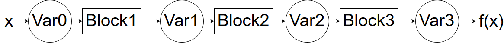

#########################
Implementation
#########################

Recalling the `background section <https://autograd.readthedocs.io/en/latest/background.html>`_, we saw that the automatic differentiation framework splits a complex function into several atomic functions which derivative is easy to compute. Then, the results are aggregated using the chaing rule. 

This package has been designed so that it is easy for a new user to define his own new atomic function. For instance, we did not implement convolution operations over vectors, but a new user could easily define it, following the API we will describe.

**Important :** The functionment of the package is slightly different depending on wether you use the forward or the reverse mode. In this optic, we will first present the forward mode and then highlight the differences happening in the reverse mode.

************
Forward Mode
************
The core data structures in this package are ``Variables`` and ``Blocks``.

We are going to consider that every function can be split into core atomic functions, each of which we will call a `Block`. Thus, the application of a function is a mere composition of `Block` operations to `Variable`s. 




Variable
--------

The first core data structure is `Variable`. This object will flow through several `Blocks`, storing the new values of the functions computed, as well as the gradient computed so far.

.. image:: img/Variable.png

It contains two main attributes : ``data`` and ``gradient``. The `data` attribute stores the value of the function computed so far. The `gradient` attribute contains **the value of the derivative of this node with respect to the input node**. It is defined for every variable but note that in the reverse mode, the `gradient` attribute is only accessible on the output node, we'll develop this further.

In each block, the input ``Variable`` brings the information from the previous data and gradients computed and propagates the data and gradient flow forward.

For exemple, taking the previous example : Var2.data will be the numpy array resulting from the sequence of operations ``Block2(Block1(Var.data))``

Samely, Var2.gradient will contain the gradient of the function ``x-->Block2(Block1(x))`` evaluated at the point x=Var0.data


**Initialization**

This package handles vector functions, meaning that it can compute gradients of function from Rn to Rp. Hence, the .gradient attribute is not a gradient, but rather a Jacobian matrix.

Meaning, if we assume that Var0.data is an array of shape n and Var3.data is an array of shape p, then Var3.gradient will be a matrix of shape p*n


The basic initializer for that class is :

``def __init__(self,data, gradient=None, constant=False, input_node=True):``
 
The `data` argument is either a scalar or a list/np.array that refers to the point we wish to evaluate the function. 

The `gradient` argument is used to set the gradient of this variable when we initialize it, it is used later with the `Blocks`.

The `constant` argument allows to indicate if we are dealing with an actual `Variable` or if this is just a `Constant`. See the Constant section for more explanation

The `input_node` argument is used to specify if the Variable created is the input of a complex function. Meaning, when the user want to define a new function, he will define it as ::

 def function(x):
  y=do_stuff(X)
  return(y)


thus, the `input_node` for this function is the input variable x. Note that when a user creates a new input node, it overwrites the older : you cannot have several input nodes defined with several `Variable(*args)` calls. To manage several inputs, check the following sections.


If nothing is indicated by the user, the default value of ``Variable.gradient`` is an Identity matrix, meaning we are at the beginning of the computational graph : the jacobian of a variable with respect to itself is the Identity matrix, with corresponding dimensions.

The constants are managed as Variables with a initial ``gradient`` as a matrix of 0's. See below.


Constant
-----------

A `Constant` object is just meant to embed the notion of constants in the operations we encounter. For instance, if you want to compute the gradient of ``f(x)=7*x+3``. We will not compute derivatives with respect to `7` or `3` which would not make sense. Rather, we embed the constants in the function within this class. 

A `Constant` is a subclass of `Variable` but it is always initialized with a `gradient` attribute as a Jacobian of 0's. This way, we ensure that this constant does not participate in the gradient computation.

The reason why we decided to embed these constants as variables, is because it allows to have a unified API for these two objects. The difference is that constants are used in the data flow but not in the gradient flow. Also, a `Constant` cannot be the input node of the computational graph, obviously.


Multiple Variables
-------------------

As this package handles vector to vector mapping, we can theoretically consider every function of several variables as a function of vector input. For exemple, we can see the function ``f(x,y,z)`` as a function of 3 variables which are scalar, but also as a function of one variable, which is a vector of R3.

Thus, if you want to opt for the vector approach, you will have to process as follows : 

- vector approach 

In this approach, you define one big input node that embbeds all your input variables ::

def f(x,y,z):
 vector_variable=Variable([x,y,z])  #create the vector variable with the data of x,y and z
 
 #extract the relevant variables
 #the [] operator extracts both data and gradient and create a new corresponding variable 
 x_var, y_var, z_var = vector_variable[0], vector_variable[1], vector_variable[1] 
 
 output=do_stuff(x_var, y_var, z_var)
 return(outpput)

Let's assume that the output of this function is a scalal, this way you will compute the gradient of f as a function from R3 in R and the gradient of `output` will be a Jacobian matrix of shape 1*3.

Then, if you are in an optimization framework, you will have to extract the gradients of `output` with respect to each input respectively. Namely, you will want to perform the update :: 

 x <--x + lr* grad(output, x)
 y <--y + lr* grad(output, y)
 z <--z + lr* grad(output, z)

but you have to extract the gradients from the jacobian matrix :: 

 grad(output, x) = output.gradient[0,0]
 grad(output, x) = output.gradient[0,1]
 grad(output, x) = output.gradient[0,2]

or perform that update in a vectorized fashion  : ``vector_of_inputs += lr * output.gradient[0]``


- distinct inputs approach

The other way to look at it is to say, that f has 3 input variables, so in our framework, the computational graph will have 3 input nodes. 

**Disclaimer** : when you define a new `Variable` it overwrites the current input node of the graph, so you should not process like :: 

 x_var = Variable(x)
 y_var = Variable(y)
 z_var = Variable(z)

If you do this, the input node of the graph will be z_var... 

To tackle this, you will use the **classmethod** of Variable : 

``x_var, y_var, z_var = Variable.multi_variables(x,y,z)``

This function defines several input variables, and set them as input nodes of the graph. Then the program runs as usual, with one difference : still with the previous example, the function f will have 3 inputs and not one big vector input

Hence, `output.gradient` will be equal to the **list** of the gradients of f with respect to all the variable **in the same order they have been defined**. Namely : 

``output.gradient = [grad(output, x), grad(output, y), grad(output, z)]`` 

with ``grad(output, x)`` an array of shape 1*1. If f had an output dimension of p, we would have ``grad(output, x)`` as a matric of shape p*1.

In this exemple, I took x, y and z as scalars, but you could totally define a function like :: 

 def f(x, L):
  x_var, L_var = Variable.multi_variables(x,L)
  ...
  
 with x a scalar and L a list of size n.
 
 


Block
-----


The second core data structure is the ``Block``. It is an atomic operation performed on ``Variable``. For instance, sin, exp, addition or multiplication.

.. image:: img/Block.png

The ``Block`` contains two major methods : ```data_fn ``` and ```gradient_fn ```.

```data_fn ``` is used to compute the function evaluation for that block. For example we can use::

    import autograd as ad
    from autograd.variable import Variable

    #instantiate a block
    x= Variable(3)
    y= ad.sin(x)

and the new ``Variable`` y, will have its ``data`` attribute set to ``av.trig.sin.data_fn(3)`` = ``sin(3)``

``gradient_fn`` is used to compute the gradient evaluation for that block. Keeping the same example, we have::

    import autograd as ad
    from autograd.variable import Variable
    #instantiate a block
    x= Variable(3)
    y= ad.sin(x)

As previously stated, the variable x has the default value for ``gradient``, which is an array of ones. Then, the block sin will create a new variable y, which ``data`` attribute has already been explained above. The ``gradient`` attribute is set to ``ad.block.sin.gradient_fn(3) * x.gradient = cos(3) * 1``

Note that for more complex functions, the ``gradient_fn`` is combined with the method ``gradient_forward``. For the multiplication for instance, we will use ``gradient_forward`` to push forward the gradient flow, same for the addition, and other basic operations.

The way to see ``gradient_forward`` is the following :
Let's consider a computational graph which transforms : x_0 --> x_1 --> x_2 --> x_3 --> y

let's call the output of the last block y, then the output of gradient_forward(x_3), will contain the jacobian of the function x_0 --> y. More generally, the output of gradient_forward(x_i) will contain the Jacobian matrix of the function : x_0 --> x_i

this function is in charge of pushing the gradients forward, it will combine the previously computed gradients to the derivative of this block_function

*No storing of the computational graph*

The solution we provided is efficient in that we don't store the computation graph. The values of the variables are computed on the fly, both data and gradient.

*Classes implemented*

As hinted before, we will have a class for the `Variable` and another class for `Block`.
Though each elementary function will be assigned a subclass of `Block` : we will have a set of `Block` functions hard-coded from which we expect the user to build his/her complicated combinations.

Example of this set could be: sin, cos, tan, exp, pow, sum, mean, ...

Of course, the ``autograd`` package is being built respecting the design patterns for good development, the user will have the possibility to build his own `Block` if he would not find a specific function among the ones we provide. The user would have to follow the `Block` interface and provide a ``data_fn`` as well as a ``grad_fn`` (leveraging *duck typing*).

*External dependencies*

The package is highly reliant on ``Numpy``. The Demo_Notebook uses ``matplotlib``, but ``matplotlib`` is not required for the autograd to run. 
