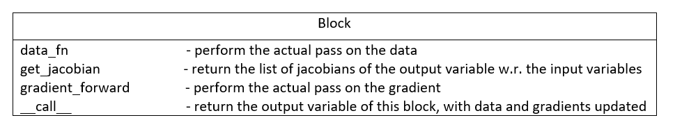

#########################
Implementation
#########################

Recalling the `background section <https://autograd.readthedocs.io/en/latest/background.html>`_, we saw that the automatic differentiation framework splits a complex function into several atomic functions which derivative is easy to compute. Then, the results are aggregated using the chaing rule. 

This package has been designed so that it is easy for a new user to define his own new atomic function. For instance, we did not implement convolution operations over vectors, but a new user could easily define it, following the API we will describe.

**Important :** The functionment of the package is slightly different depending on wether you use the forward or the reverse mode. In this optic, we will first present the forward mode and then highlight the differences happening in the reverse mode.

************
Forward Mode
************

The core data structures in this package are ``Variables`` and ``Blocks``.

We are going to consider that every function can be split into core atomic functions, each of which we will call a `Block`. Thus, the application of a function is a mere composition of `Block` operations to `Variable`s. 

.. image:: img/easy_function.png

Variable
--------

The first core data structure is `Variable`. This object will flow through several `Blocks`, storing the new values of the functions computed, as well as the gradient computed so far.

.. image:: img/Variable.png

It contains two main attributes : ``data`` and ``gradient``. The `data` attribute stores the value of the function computed so far. The `gradient` attribute contains **the value of the derivative of this node with respect to the input node**. It is defined for every variable but note that in the reverse mode, the `gradient` attribute is only accessible on the output node, we'll develop this further.

In each block, the input ``Variable`` brings the information from the previous data and gradients computed and propagates the data and gradient flow forward.

For exemple, taking the previous example : Var2.data will be the numpy array resulting from the sequence of operations ``Block2(Block1(Var.data))``

Samely, Var2.gradient will contain the gradient of the function ``x-->Block2(Block1(x))`` evaluated at the point x=Var0.data

The main method of a variable is ``.compute_gradients()`` : it allows the `gradient` attribute of a variable to be propperly defined. In reverse mode, it triggers the reverse gradient flow, as we will see.

In forward mode, even if the gradients are computed on the fly, we need to call the compute_gradients() method, as it allows to handle the case where you have several input nodes. See below.

**Initialization**

This package handles vector functions, meaning that it can compute gradients of function from Rn to Rp. Hence, the .gradient attribute is not a gradient, but rather a Jacobian matrix.

Meaning, if we assume that Var0.data is an array of shape n and Var3.data is an array of shape p, then Var3.gradient will be a matrix of shape p*n

The basic initializer for that class is :

``def __init__(self,data, gradient=None, constant=False, input_node=True):``
 
The `data` argument is either a scalar or a list/np.array that refers to the point we wish to evaluate the function. 

The `gradient` argument is used to set the gradient of this variable when we initialize it, it is used later with the `Blocks`.

**Attention** : before tring to access the `.gradient` of a Variable, you should always call ``my_var.compute_gradients()``

The `constant` argument allows to indicate if we are dealing with an actual `Variable` or if this is just a `Constant`. See the Constant section for more explanation

The `input_node` argument is used to specify if the Variable created is the input of a complex function. Meaning, when the user want to define a new function, he will define it as ::

 def function(x):
  y=do_stuff(X)
  return(y)

thus, the `input_node` for this function is the input variable x. Note that when a user creates a new input node, it overwrites the older : you cannot have several input nodes defined with several `Variable(*args)` calls. To manage several inputs, check the following sections.

If nothing is indicated by the user, the default value of ``Variable.gradient`` is an Identity matrix, meaning we are at the beginning of the computational graph : the jacobian of a variable with respect to itself is the Identity matrix, with corresponding dimensions.

The constants are managed as Variables with a initial ``gradient`` as a matrix of 0's. See below.

Constant
-----------

A `Constant` object is just meant to embed the notion of constants in the operations we encounter. For instance, if you want to compute the gradient of ``f(x)=7*x+3``. We will not compute derivatives with respect to `7` or `3` which would not make sense. Rather, we embed the constants in the function within this class. 

A `Constant` is a subclass of `Variable` but it is always initialized with a `gradient` attribute as a Jacobian of 0's. This way, we ensure that this constant does not participate in the gradient computation.

The reason why we decided to embed these constants as variables, is because it allows to have a unified API for these two objects. The difference is that constants are used in the data flow but not in the gradient flow. Also, a `Constant` cannot be the input node of the computational graph, obviously.

Multiple Variables
-------------------

As this package handles vector to vector mapping, we can theoretically consider every function of several variables as a function of vector input. For exemple, we can see the function ``f(x,y,z)`` as a function of 3 variables which are scalar, but also as a function of one variable, which is a vector of R3.

Thus, if you want to opt for the vector approach, you will have to process as follows : 

- vector approach 

In this approach, you define one big input node that embbeds all your input variables ::

 def f(x,y,z):
  vector_variable=Variable([x,y,z])  #create the vector variable with the data of x,y and z 
  
  #extract the relevant variables
  #the [] operator extracts both data and gradient and create a new corresponding variable 
  x_var, y_var, z_var = vector_variable[0], vector_variable[1], vector_variable[1]  
  
  output=do_stuff(x_var, y_var, z_var)
  return(outpput)

Let's assume that the output of this function is a scalal, this way you will compute the gradient of f as a function from R3 in R and the gradient of `output` will be a Jacobian matrix of shape 1*3.

Then, if you are in an optimization framework, you will have to extract the gradients of `output` with respect to each input respectively. Namely, you will want to perform the update :: 

 x <--x + lr* grad(output, x)
 y <--y + lr* grad(output, y)
 z <--z + lr* grad(output, z)

but you have to extract the gradients from the jacobian matrix :: 
 #never forget to compute_gradients() before trying to access to the gradient of a variable
 output.compute_gradients()
 grad(output, x) = output.gradient[0,0]
 grad(output, x) = output.gradient[0,1]
 grad(output, x) = output.gradient[0,2]

or perform that update in a vectorized fashion  : ``vector_of_inputs += lr * output.gradient[0]``

- distinct inputs approach

The other way to look at it is to say, that f has 3 input variables, so in our framework, the computational graph will have 3 input nodes. 

**Disclaimer** : when you define a new `Variable` it overwrites the current input node of the graph, so you should **not** process like :: 

 x_var = Variable(x)
 y_var = Variable(y)
 z_var = Variable(z)

If you do this, the input node of the graph will be z_var... 

To tackle this, you will use the **classmethod** of Variable : 

``x_var, y_var, z_var = Variable.multi_variables(x,y,z)``

This function defines several input variables, and set them as input nodes of the graph. Then the program runs as usual, with one difference : still with the previous example, the function f will have 3 inputs and not one big vector input

Hence, `output.gradient` will be equal to the **list** of the gradients of f with respect to all the variable **in the same order they have been defined**. Namely ::

 output.compute_gradients()
 # we have : output.gradient = [grad(output, x), grad(output, y), grad(output, z)]

with ``grad(output, x)`` an array of shape 1*1. If f had an output dimension of p, we would have ``grad(output, x)`` as a matrix of shape p*1.

In this exemple, I took x, y and z as scalars, but you could totally define a function like :: 

 def f(x, L):
  x_var, L_var = Variable.multi_variables(x,L)
  ...
  
With x a scalar and L a list of size n.

**In this context of multi_variables**, we basically create one big variable that aggregates all the individual inputs and then extract them as variables, it also sets these variabales as the input nodes of the computational graph . This process allows to define one single input variable while defininig several input nodes. 

In forward mode, it is useful as when we call `compute_gradients`, we will return the list of the gradients of the output node w.r. all the single input variables. We thus need to know which are the input nodes and in which order they have been defined. This `multi_variables` function allows to do this.

In reverse mode, it is also useful to define the input nodes of the computational graph.
 

Block
----------

The second core data structure is the ``Block``. It is an atomic operation performed on ``Variable``. For instance, sin, exp, addition or multiplication. for flexibility of the code, we implemented a generic `Block` type as well as a more specific one : the `SimpleBlock`.

In `Autograd`, all the blocks stand for functions : we have the sinBlock, the cosBlock, ..., and also the extractBlock that overrides the [] method...

Thus, before calling a function on a variable, we need to instantiate the corresponding block and then call it ::

 from autograd.blocks.trigo import sin
 from autograd.variable import Variable

 x= Variable(3)
 sinBlock=sin()
 y=sinBlock(x)
 
However, in order to have a better user experience, we instantiate all the blocks in the `__init__.py` of `Autograd` so that the user can directly have access to these blocks ::

 from autograd.variable import Variable

  x= Variable(3)
  y=ad.sin(x)

We will describe the different blocks we have but all of them work as follows : It takes one or several input variables and then tt outputs a new Variable with updated data and gradient.

Main Block
^^^^^^^^^^^

In forward mode, the ``Block`` contains four major methods that we will describe : 

- data_fn

It is used to define the function evaluation for that block. For example in the `additionBlock`, we coded ::

 class add(Block):
   """
   addition of two vector inputs
   """
   def data_fn(self, *args):
     #returns the data of the output variable of this block
     new_data = np.add(args[0].data, args[1].data)
     return(new_data)

This method is specific to each block

- get_jacobians

Every block defines an atomic function. The `get_jacobian` method returns the jacobian of this atomic function w.r to all its inputs separately. For example, still in the `additionBlock` :: 

 class add(Block):
     """
     addition of two vector inputs
     """
     def data_fn(self, *args):
         new_data = np.add(args[0].data, args[1].data)
         return(new_data)

     def get_jacobians(self, *args):
         shape=args[0].data.shape[0]
         first_term = np.eye(shape)
         second_term = np.eye(shape)

         return([first_term, second_term])
         
In fact, when we have ``z=x+y`` we have grad(z, x) as the Identity matrix with corresponding shape. Samely for grad(z, y)
 
This method is specific to each block

- gradient_forward 

Is used to propagate the gradient flow forward : it takes the gradients of the input variables of the block, multiply them with the jacobians of this bloc, thanks to the `.get_jacobians()` method. And then it outputs the gradient of the output variable ::

 class Block():
   def gradient_forward(self, *args, **kwargs):
     #concatenate the input gradients
     input_grad = np.concatenate([var.gradient for var in args], axis=0)

     #concatenate the jacobians of the block
     jacobians = self.get_jacobians(*args, **kwargs)
     jacobian = np.concatenate([jacob for jacob in jacobians], axis=1)

     #combine the gradients of the input variables with the jacobians of the block
     new_grad = np.matmul(jacobian, input_grad)

     return(new_grad)
     
This method is common to all the blocks

Explanation :

Let's consider a computational graph which transforms : ``x = x_0 --SINBLOCK--> x_1 --COSBLOCK--> x_2 --EXPBLOCK--> x_3 = f(x)``

As previously stated, the variable x_0 has the default value for ``gradient``, which is the identity matrix. with gradient_forward, the SINBOCK will output a variable which has a data of ``sin(x_0.data)`` and a gradient of ``cos(x_0.data) * x_0.gradient``. 

Then, COSBLOCK will output a variable with data = ``cos(x_1.data) = cos(sin(x_0.data))`` and gradient = ``-sin(x_1.data) * x_1.gradient``, and we will have 

``x_2.gradient = jac_COSBLOCK * jac_SINBLOCK * x_0.gradient``

This is how the gradients flow in the forward mode.

- __call__

take as input one or several variables, perform a forward pass on data and gradient and return a new output variable.

``new_var = block(input_var_1, input_var_2)`` 

**No storing of the computational graph**

The solution we provided is efficient in that we don't store the computation graph in the forward mode. The values of the variables are computed on the fly, both data and gradient.

Usually, the user overwrite its variable so we have a minimal memory usage :: 

 import autograd as ad
 from autograd.variable import Variable

 x=Variable([34,54,65])
 y=ad.sin(x)
 y=ad.cos(y)
 y=ad.exp(y)
 for _ in range(12345):
   y *= 3
 
 output = y+x
 
 
the variable y has been overwriten : in this sequence of operations, we have stored only 3 variables : x, y, and output.

If we were to store naively all the computational graph, we would have stored way more variables....

Of course, the ``autograd`` package is being built respecting the design patterns for good development, the user will have the possibility to build his own `Block` if he would not find a specific function among the ones we provide. The user would have to follow the `Block` interface and provide a ``data_fn`` as well as a ``get_jacobians``. 

However sometimes, the block we want to implement is just a vectorized simple function. For instance, sin(x) applies sin(.) to all the elements of x.data. This leads to the useful subclass to handle vectorized functioons, the `SimpleBlock`

Simple Block
^^^^^^^^^^^^

The simple block allows to represent simple functions : in the context of vector mapping, we usually have some functions that apply the same operations to all the elements. They are called vectorized functions.

For example, ``sin(x) = [sin(elt) for elt in x.data]``

For these functions, which have only one input, the jacobian is easy to compute, it is equal to the diagonal matrix with the derivative of the block evaluated at the input points. In other words ::

``jacobian = np.diag(block.gradient_fn(input_variable))``

Thus, for this class we overwrite the `.get_jacobians()` as follows :: 

  def get_jacobians(self, *args, **kwargs):
         """
         get the Jacobian matrix of the simple block. It is a diagonal matrix easy to build from the
         derivative function of the simpleBlock
         """
         #get the elements of the diagonal
         elts = self.gradient_fn(*args, **kwargs)
         jacobian = np.diag(elts)
         return([jacobian])
         
This is a method generic for all the simple blocks

We thus implement a `data_fn` as previously, but now, instead of defining a `get_jacobians()` method, we only need to define the derivative of the simple function, in a new method `gradient_fn()`. For example for the `SinBlock` ::

 class sin(SimpleBlock):
     """
     vectorized sinus function on vectors
     """
     def data_fn(self, args):
         new_data = np.sin(args.data)
         return(new_data)

     def gradient_fn(self, args):
         grad = np.cos(args.data)
         return(grad)
         

The `gradient_fn()` method is specific to each block. 

This elegant way to represent functions allows an easy definition of new blocks, but more : it allows the implementation of the reverse mode in an elegant fasion.

************
Reverse Mode
************

In the reverse mode, the gradients are not computed from the input nodes to the output nodes in the computational graph. Instead, they are computed from the output node to the input nodes.

The reverse mode applies a forward mode on the data, stores relevant information, and applies a reverse pass on the gradients.

To do this, we need to store all the intermediate values that have been used to compute the output variable. 

We achieve this by doing the following modifications on the classes :

Variable
--------

- gradient 

This attribute is no more accessible to all the variables. The only variable that as a non`None` gradient attribute is the output variable **after** having called ``output_variable.compute_gradients()`` 
  
- .compute_gradients()

This method now applies the reverse pass to compute the gradients, it also allows to have access to the output_variable.gradient attribute
 
- node

We also introduce a new class for the reverse mode, the `Node`. We will describe it in the next section
 
 
Node
-----

Previously, we were talking without distinction of nodes and variables. Now however, we will be very careful not to mix these two concepts. 

A `Node` is a new separate class used in the reverse mode, that allows to store relevant information from the forward pass. Everytime a new Variable is created, a node is created, stored in a global buffer (`config` file), and is associated to the variable. A node has two main attributes : `gradient`and `childrens` : 

- gradient

It is used to store the gradient of the output variable w.r. this node's variable. Meaning that ``output_variable.node.gradient = Identity`` and ``input_variable.node.gradient`` is actually the gradients we are looking to compute : it is the gradient of the function w.r. the input variables.

- childrens 

list that store the nodes of the variables that have been used to compute this new node's variable, and their respective gradient. Namely ::

x=Variable(2)
y=sin(x)
z=x+y

`x` is the input_node, his node's children dictionnary is empty. 

`y`'s node has one children : `x`'s node. Moreover, the transformation x-->y is associated with a ``jacobian = cos(x.data)``. Thus, we will have ``y.node.childrens=[{'node':x.node, 'jacobian':cos(x.data)}]`` 

`z`'s node has two childrens : `x`'s node and `y`'s node. Moreover, the transformation x,y-->z is associated with two jacobians

``jacobian_x = identity``

``jacobian_y = identity``

Thus, we will have ``z.node.childrens=[{'node':x.node, 'jacobian':identity}, {'node':y.node, 'jacobian':identity}]``

The main method of `Node` is the `backward()` method : 

It is used to compute **recursively** the gradients of the ouput variable w.r. to the input node.

To do this, it sets the gradient of the output node to the identity, and propagate backwards the gradients using the children's jacobians : 

For each children node, it computes the contribution of this node to the output gradient, and updates the `gradient` of the children node ::

 for child in self.childrens:
   node,jacobian=child['node'], child['jacobian']
   new_grad = np.dot(self.gradient, jacobian)
   node.update_gradient(new_grad)
   
This process is repeated until we computed the gradients of all the input nodes, they are the nodes for which ``childrens=[]``.

At the end of this function call, all the nodes involved in the computational graph have a `gradient` attribute set.

Computational Graph
---------------------

Main class that stores the information of the computational graph. It is defined in the ``__init__.py`` of `Autograd` so that we can access it anytime with ``ad.c_graph``

Should be noted that as we store the dependencies among the nodes in the nodes themselves, we don't need to store them again in the computational graph. Meaning : every node define a tree with the `childrens` attribute, we only need to store the global informations about the computational graph : 

- input_nodes

List that store the input nodes of the computational graph

- output_node

Store the output node of the computational graph

- input_shapes

List that store the shapes of the input variables. For example with ``x, L, y, Z = Variable.multi_variables(x, L, y, z)``

we will have ``ad.c_graph.input_shapes = [dim(x), dim(L), dim(y), dim(Z)]`` (with dim(x) the dimension of the scalar/vector of x). This attribute is important only when dealing with several distinct inputs, when we need to reconstruct the several distinct gradients in the `compute_gradients()` call

Given these informations, we can compute the reverse pass on the gradients. Here is the event flow :  

1. User calls ``output_variable.compute_gradients()``

2. This function will first define the output node of the computational graph as the output_variable.node

3. given this output node, we make a first reverse pass to see which nodes have been used to compute this output_variable, and how many times.

For example, in the case ::

 x=Variable(3)
 y=sin(x)
 output_variable=x+x
 
The define path will assess the several numbers :: 

 x.node.times_used = 2
 y.node.times_used = 0 
 output_variable.node.times_used = 0
 
As the variable `y` did not contribute to the computation of the output node, and the output node has not been used to compute anyting.

4. We call `backward()` on the output variable node. This function will set the node's gradient of all the nodes selected in the `define_path()` call
 
5. If the computational graph has one input node, we return the gradient of this vector mapping. Is is a jacobian matrix. The       `output_variable.gradient` attribute is set to this matrix, as in the forward mode.

6. If we have several input nodes (defined with multi_variables), we return the list of the jacobians defining the contribution of each of the input nodes. The `output_variable.gradient` attribute is set to this list of matrices, as in the forward mode.

- reset_graph

Eventually, when we want to re-run the function, we need to reset the graph : we zero the gradients, as well as the number of times the nodes have been used.

**Note** that when the user define a new Variable, it automatically sets this variable as input node of the graph. Thus, we can remove all the previously created nodes and restart from scratch : the buffer that store the nodes created is flushed. Thus, we cannot use the previously created variables, we need to recompute them.

 

Block
------

In the reverse mode, the only method modified is the `__call__` : 

- The forward data pass is not modified, we create a new variable with corresponding updated data attribute

- The ouput variable is created with a node. We set this node's `childrens` using the jacobians of the block and the input variables` nodes

