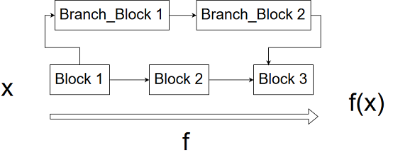

# Report for Milestone 1

# Introduction
This project aims at building a software library for **Automatic Differentiation**, or **AD**.
The goal of AD is to provide an **accurate** estimate of the derivative of a given function. It combines the advantages of 
Numerical Methods such as Finite Differences, and the Symbolic Computing that builds a symbolic expression of the derivative. 
AD is able to compute an approximation of the derivative of a function, **without computing a symbolic expression** of the derivative and 
with an **accuracy of machine precision**.

AD has many applications accross Science and Engineering, the most popular one these days being Deep Neural Networks. These models 
try to fit a function with >10M parameters to a dataset. To do so, they use Gradient Descent algorithms using gradients approximations provided
by AD. Famous applications include **Alpha Go**, **Self-Driving Cars** and **Image Recognition**.

# Background
The basic idea that underpins the AD algorithm is the chain rule: 


Essentially what the algorithm does is take a complex function and rewrite it as a composition of elementary functions. Then, using stored symbolic derivatives for these elementary functions, the algorithm "reverse expands" the chain rule by starting with the innermost function and building on it. 

In other words, we will represent a function whose derivative we wish to compute by a "computational graph" which builds up some set of operations sequentially. We will pass our input value along the "trace", and by judicious application of the chain rule, we will compute the derivative of the overall function.

An example of a computational graph is: 

# How to Use AutoGrad?

Basic usage is as follows:

```python
>>> import autograd as ad
>>> x1 = ad.Variable(0) # create a variable holding the value at which we will evaluate the function
>>> x2 = ad.block.sin(x1) # add a computational block, here the `sin` function
>>> y = x2 # y contains the final output of the computational graph
>>> print(y.gradient) # this is the gradient of the function sin(x) evaluated at x=0
1
```

# Software Organization

We will break up our `autograd` package into various modules. Our basic directory structure will look as follows:

```
cs207-FinalProject/
    autograd/
        blocks/
          block.py
        tests/
        utils.py
        variable.py
    docs/
    README.md
```

This is not an exhaustive list of everything that will be contained in our project repository, but will highlight the main organization. It is broken down into a few key modules:
- `block.py`: objects implementing the core computational units of the graph, namely `data_fn` (f(x)) and `gradient_fn` (f'(x))
- `variable.py`: data structure containing the function value and gradient value
- `utils.py`: general utility functions that are reused throughout the project

Of course, we will also have `tests` that contain all the tests of our codes and `docs` that contains useful information about the project.

# Implementation
The core data structures are `Variables` and `Blocks`.

We are goin to consider that every function can be splitted into core components, each of which being called a `Block`. Thus, the application of a function is a mere composition of `Block` operations. The function


* `Variable`

The first core data structure is `Variable`. This object will flow through the several `Blocks`, storing the new values of the functions computed, as well as the gradient computed so far.


It contains two main attributes : data and gradient. In each block, the input Variable brings the info from the previous value functions and the previous gradients computed so far and propagates the data flow as well as the gradient flow.

Note that we are not doing in-place modification of the input `Variable` in each `Block` as we may need of this `Variable` later in the computation

If nothing is indicated by the user, the default value of `Variable.gradient` is an array of ones, meaning we are at the beginning of the computational graph

* `Block` 

The second core data structure is the `Block`. It is basically an atomic operation performed on `Variables`. For instance, sin, exp, addition or multiplication.


It contains two major methods : ```data_fn ``` and ```gradient_fn ```. 

```data_fn ``` is used to compute the function evaluation for that block. For example we can use :
```python
import autograd as ad
x=ad.Variable(3)
y=ad.block.sin(x)
```
and the new `Variable` y, will have its `data` attribute set to `ad.block.sin.data_fn(3)=sin(3)`

```gradient_fn ``` is used to compute the gradient evaluation for that block. Keeping the same example, we have : 
```python
import autograd as ad
x=ad.Variable(3)
y=ad.block.sin(x)
```
As previously stated, the variable x has the default value for `gradient`, which is an array of ones. Then, the block sin will create a new variable y, which `data` attribute has already been explained above. The `gradient` attribute is set to `ad.block.sin.gradient_fn(3) * x.gradient = cos(3) * 1`

* Branched computation graph 

All the `Blocks` will create new `Variables` as output, nothing is modified in-place. This way, if we deal with a computation graph containing branches, the user can easily build his function as follows : 



```python
import autograd as ad
from ad.block import block1, block2, block3, branch_block1, banch_block2

def my_function(x):
  x=ad.Variable(3)

  #first block common for both paths
  y=block1(x)

  #compute the main block path
  z=block2(y)

  #compute the branch path
  u=branch_block1(y)
  u=branch_block2(u)

  #merge branches
  output=block3(z,u)
  
  return(output)

```


* No storing of the compuation graph

The solution we provied is efficient in the way that we don't store the computation graph. The values of the variables are computed on the fly, data and gradient.

As you can see in the previous exemple, the user only need to store in a specific variable the variable that will be used for branched paths, but besides this the intermediate variables are overriden. See : 
```python
[...]
#compute the branch path
  u=branch_block1(y)
  u=branch_block2(u)
 [...]
```


* Classes implemented

As hinted before, we will have a class for the `Variable` and another class for `Block`.
Though, each elementary function will be asigned a subclass of `Block` : we will have a set of `Block` functions hard-coded from which we expect the user to build its complicated combinaisons.

Exemple of this set could be : sin, cos, tan, exp, pow, sum, mean, ...

Of course, the `autograd` package being built respecting the design patterns for good development, the user will have the possibility to build his own `Block` if he would not find a specific function among the ones we provide. The user would have to follow the `Block` interface and provide a `data_fn` as well as a `grad_fn`

* external dependencies 

We will build our package relying highly on numpy. So far it is the only external dependency we use


# Additional Comments

We may additionally provide a reverse-mode implementation.
