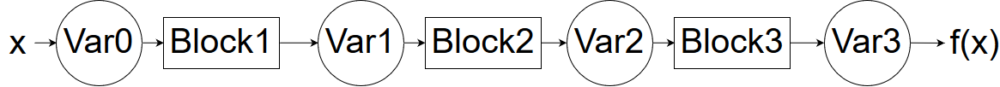

# Report for Milestone 1

# Introduction
This project aims at building a software library for **Automatic Differentiation**, or **AD**.
The goal of AD is to provide an **accurate** estimate of the derivative of a given function. It combines the advantages of 
Numerical Methods such as Finite Differences, and the Symbolic Computing that builds a symbolic expression of the derivative. 
AD is able to compute an approximation of the derivative of a function, **without computing a symbolic expression** of the derivative and 
with an **accuracy of machine precision**.

AD has many applications accross Science and Engineering, the most popular one these days being Deep Neural Networks. These models 
try to fit a function with >10M parameters to a dataset. To do so, they use Gradient Descent algorithms using gradients approximations provided
by AD. Famous applications include **Alpha Go**, **Self-Driving Cars** and **Image Recognition**.

# Background
The basic idea that underpins the AD algorithm is the chain rule: 


Essentially what the algorithm does is take a complex function and rewrite it as a composition of elementary functions. Then, using stored symbolic derivatives for these elementary functions, the algorithm "reverse expands" the chain rule by starting with the innermost function and building on it. 

One useful trick to implementing the AD algorithm is to leverage [dual numbers](https://en.wikipedia.org/wiki/Dual_number). Dual numbers are useful because if we evaluate a function using a dual number `x` then the dual number `y` that is returned by the function:
1. contains, in the *real part* (of `y`), the value of the function evaluated at the real part of the initial dual number (`x`)
2. the function **derivative** evaluated at the real part of the initial dual number (`x`) in the *dual part* of `y`

Leveraging this useful property of dual numbers is key to implementing AD elegantly and efficiently.

# How to Use FancyProjectName ?

```
You can include code-like markdown like this : 
function test() {
  console.log("notice the blank line before this function?");
}
```

# Software Organization

# Implementation
The core data structures are `Variables` and `Blocks`.

We are goin to consider that every function can be splitted into core components, each of which being called a `Block`. Thus, the application of a function is a mere composition of `Block` operations.



We will implement 

# Additional Comments
