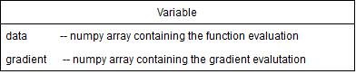

# Report for Milestone 1

# Introduction
This project aims at building a software library for **Automatic Differentiation**, or **AD**.
The goal of AD is to provide an **accurate** estimate of the derivative of a given function. It combines the advantages of 
Numerical Methods such as Finite Differences, and the Symbolic Computing that builds a symbolic expression of the derivative. 
AD is able to compute an approximation of the derivative of a function, **without computing a symbolic expression** of the derivative and 
with an **accuracy of machine precision**.

AD has many applications accross Science and Engineering, the most popular one these days being Deep Neural Networks. These models 
try to fit a function with >10M parameters to a dataset. To do so, they use Gradient Descent algorithms using gradients approximations provided
by AD. Famous applications include **Alpha Go**, **Self-Driving Cars** and **Image Recognition**.

# Background
The basic idea that underpins the AD algorithm is the chain rule: 


Essentially what the algorithm does is take a complex function and rewrite it as a composition of elementary functions. Then, using stored symbolic derivatives for these elementary functions, the algorithm "reverse expands" the chain rule by starting with the innermost function and building on it. 

One useful trick to implementing the AD algorithm is to leverage [dual numbers](https://en.wikipedia.org/wiki/Dual_number). Dual numbers are useful because if we evaluate a function using a dual number `x` then the dual number `y` that is returned by the function:
1. contains, in the *real part* (of `y`), the value of the function evaluated at the real part of the initial dual number (`x`)
2. the function **derivative** in the *dual part* of `y` evaluated at the real part of the initial dual number (`x`) 

Leveraging this useful property of dual numbers is key to implementing AD elegantly and efficiently.

# How to Use AutoGrad?

```python
>>> import AutoGrad as ag
>>> a = 2.0
>>> x = ag(a)
>>> f = sin(x) - 1/x + x**2
>>> print(f.val, f.der)
4.4092974268, 3.8338531635
```

# Software Organization

We will break up our `AutoGrad` package into various modules.

# Implementation
The core data structures are `Variables` and `Blocks`.

We are goin to consider that every function can be splitted into core components, each of which being called a `Block`. Thus, the application of a function is a mere composition of `Block` operations. The function


* `Variable`
The first core data structure is `Variable`. This object will flow through the several `Blocks`, storing the new values of the functions computed, as well as the gradient computed so far.



It contains two main attributes : data and gradient. In each block, the input Variable brings the info from the previous value functions and the previous gradients computed so far and propagates the data flow as well as the gradient flow.

Note that we are not doing in-place modification of the input `Variable` in each `Block` as we may need of this `Variable` later in the computation

If nothing is indicated by the user, the default value of `Variable.gradient` is an array of ones, meaning we are at the beginning of the computational graph

* `Block` 
The second core data structure is the `Block`. It is basically an atomic operation performed on `Variables`. For instance, sin, exp, addition or multiplication.


It contains two major methods : ```data_fn ``` and ```gradient_fn ```. 

```data_fn ``` is used to compute the function evaluation for that block. For example we can use :
```
import autograd as ad
x=ad.Variable(3)
y=ad.block.sin(x)
```
and the new `Variable` y, will have its `data` attribute set to `ad.block.sin.data_fn(3)=sin(3)`

```gradient_fn ``` is used to compute the gradient evaluation for that block. Keeping the same example, we have : 
```
import autograd as ad
x=ad.Variable(3)
y=ad.block.sin(x)
```
As previously stated, the variable x has the default value for `gradient`, which is an array of ones. Then, the block sin will create a new variable y, which `data` attribute has already been explained above. The `gradient` attribute is set to `ad.block.sin.gradient_fn(3) * x.gradient = cos(3) * 1`


* Classes implemented
As hinted before, we will have a class for the `Variable` and another class for `Block`.
Though, each elementary function will be asigned a subclass of `Block` : we will have a set of `Block` functions hard-coded from which we expect the user to build its complicated combinaisons.

Exemple of this set could be : sin, cos, tan, exp, pow, sum, mean, ...

Of course, the `autograd` package being built respecting the design patterns for good development, the user will have the possibility to build his own `Block` if he would not find a specific function among the ones we provide. The user would have to follow the `Block` interface and provide a `data_fn` as well as a `grad_fn`

* external dependencies 
We will build our package relying highly on numpy. So far it is the only external dependency we use


# Additional Comments

We may additionally provide a reverse-mode implementation.
