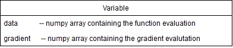
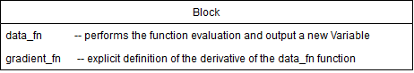

# Report for Milestone 2

# Introduction
AutoGrad is a forward mode **Automatic Differentiation** (**AD**) software library.

Differentiation is a fundamental mathematical operation that underpins much of science and engineering. Differentiation is used to describe how a function changes with respect to a specific variable. Differential equations are common throughout science and engineering; from modeling the evolution of bacteria to calculating rocket thrust over time to predictive machine learning algorithms, the ability to rapidly compute accurate differential equations is of great interest.

The symbolic derivative of a function is precise; however as the function of interest become more complex, the symbolic derivative becomes increasingly difficult to determine. Numeric methods can be used to compute the derivative of such functions. The finite difference approach uses the definition of a derivative to estimate the derivative of a function; however, it suffers from low accuracy and instability.

AD is able to compute an approximation of the derivative of a function, **without computing a symbolic expression** of the derivative and with **machine precision** accuracy.

AD has many applications across Science and Engineering, the most popular one these days being Deep Neural Networks. These models try to fit a function with >*10M* parameters to a dataset. To do so, they use Gradient Descent algorithms using gradients approximations provided by AD. Famous applications include **Alpha Go**, **Self-Driving Cars** and **Image Recognition**.

# How to use AutoGrad

### Installation

#### Requirements
AutoGrad works with [`Python3`](https://docs.python.org/3/)
#### Dependencies
* [`Numpy`](http://www.numpy.org/)

#### How to Install:
1. Create a virtual environment
```
cd my_directory
virtualenv my_env
```
2. Activate the virtual environment
```
source my_env/bin/activate
```
3. Install package
Download Package from GutHub (or clone) and Unzip
```
unzip cs207-FinalProject-master.zip
```
Install Dependencies using Pip
```
pip install -r cs207-FinalProject-master/requirements.txt
```
Install AutoGrad -- this step is **Very Important**
```
cd cs207-FinalProject-master
python3 setup.py install
```

### AutoGrad Usage

Additional resources are available in Demo_Notebook.ipynb - make sure to have matplotlib installed if you want to run the Demo_Notebook

Example: How to differentiate `f(x) = sin(x) + cos(x)` at x = pi

```python
>>> import numpy as np
>>> import autograd
>>> import autograd.variable as av
>>> import autograd.blocks.trigo as trig
>>> x = av.Variable(np.pi)
>>> sin = trig.sin()
>>> b1 = sin(x)
>>> cos = trig.cos()
>>> b2 = cos(x)
>>> b3 = b1 + b2
>>> print(b3.gradient)
-1
```
b3 will contain the gradient of `y = sin(x) + cos(x)` at x = pi


Example: How to differentiate `f(x)=sin(cos(x+3)) + e^(sin(x)^2)` at x = 1

```python
>>> import numpy as np
>>> import autograd
>>> import autograd.variable as av
>>> import autograd.blocks.trigo as trig
>>> import autograd.blocks.expo as expo
>>> sin = trig.sin()
>>> cos = trig.cos()
>>> exp = expo.exp()
>>> x = av.Variable(1)
>>> b1 = x + 3
>>> b2 = sin(x)
>>> b3 = cos(b1)
>>> b4 = sin(b3)
>>> b5 = b2*b2
>>> b6 = exp(b5)
>>> b7 = b6 + b4
>>> print(b7.gradient)
2.44674864
```
b7 will contain the gradient of `f(x)=sin(cos(x+3)) + e^(sin(x)^2)` at x = 1


# Background
The basic idea that underpins the AD algorithm is the chain rule:


Essentially what the algorithm does is take a complex function and rewrite it as a composition of elementary functions. Then, using stored symbolic derivatives for these elementary functions, the algorithm "reverse expands" the chain rule by starting with the innermost function and building on it. This means that the gradient of the innermost function will be computed and passed through and computed in each other function until reaching the original function.

In other words, we will represent a function whose derivative we wish to compute by a "computational graph" which builds up some set of operations sequentially. In the computational graph, each note is a basic operation and the edges pass information through the nodes. In the computational graph, the data passed through the nodes contains the value of the original function and the gradient evaluated at some value.

An example of a computational graph is: 

In the example above, the `w1` node contains the gradient for input `x` at some value, the data from `w1` is then passed through the `cos()` operation to create `w3`. 'w3' later multiplied with `w4` to create `w5`, and so on. We will pass our input value along the "trace", and by judicious application of the chain rule, we will compute the derivative of the overall function. The traces can be through of as the ordered set of operations that the data undergoes.

# Software Organization

We will break up our `autograd` package into various modules. Our basic directory structure will look as follows:

```
cs207-FinalProject/
    autograd/
        __init__.py
        blocks/
            __init__.py
            block.py
            expo.py
            hyperbolic.py
            operations.py
            trigo.py
        tests/
            __init__.py
            test_basic.py
            test_autograd.py
            ...
        utils.py
        variable.py
    docs/
        milestone1.md
        milestone2.md
        ...
    README.md
    requirements.txt
    setup.py
    Demo_Notebook.ipynb
```

This is not an exhaustive list of everything that will be contained in our project repository, but will highlight the main organization. It is broken down into a few key modules:
- `block.py`: objects implementing the core computational units of the graph, namely `data_fn` (*f(x)*) and `gradient_fn` (*f'(x)*).
- Within the blocks submodule, there additional block operations - categorized by operation type.
- `variable.py`: data structure containing the function value and gradient value
- `utils.py`: general utility functions that are reused throughout the project `tests` will contain all the tests of our codes and `docs` that contains useful information about the project.

# Implementation
The core data structures are `Variables` and `Blocks`.

We are going to consider that every function can be split into core components, each of which we will call a `Block`. Thus, the application of a function is a mere composition of `Block` operations. The function


### `Variable`

The first core data structure is `Variable`. This object will flow through several `Blocks`, storing the new values of the functions computed, as well as the gradient computed so far.



It contains two main attributes : `data` and `gradient`. In each block, the input `Variable` brings the information from the previous functions and gradients computed and propagates the data and gradient flow forward. Note that because our package deals with vector functions, the `gradient` attribute is actually a `Jacobian` matrix.

If nothing is indicated by the user, the default value of `Variable.gradient` is an Identity matrix, meaning we are at the beginning of the computational graph.

For now, the constants are managed as Variables with a initial `Jacobian` as a matrix of 0. It is not efficient in the way that we still use this matrix of 0 for the gradient flow, we will probably optimize it at the next iteration.

### `Block`

The second core data structure is the `Block`. It is an atomic operation performed on `Variable`. For instance, sin, exp, addition or multiplication.



The `Block` contains two major methods : ```data_fn ``` and ```gradient_fn ```.

```data_fn ``` is used to compute the function evaluation for that block. For example we can use :
```python
import autograd.variable as av
import autograd.blocks.trigo as trig
#instantiate a block
sin = trig.sin()
x=av.Variable(3)
y=sin(x)
```
and the new `Variable` y, will have its `data` attribute set to `av.trig.sin.data_fn(3)` = `sin(3)`

```gradient_fn ``` is used to compute the gradient evaluation for that block. Keeping the same example, we have :
```python
import autograd.variable as av
import autograd.blocks.trigo as trig
#instantiate a block
sin = trig.sin()
x=av.Variable(3)
y=sin(x)
```
As previously stated, the variable x has the default value for `gradient`, which is an array of ones. Then, the block sin will create a new variable y, which `data` attribute has already been explained above. The `gradient` attribute is set to `ad.block.sin.gradient_fn(3) * x.gradient = cos(3) * 1`

Note that for more complex functions, the `gradient_fn` is combined with the method `gradient_forward`. For the multiplication for instance, we will use `gradient_forward` to push forward the gradient flow, same for the addition, and other basic operations.

The way to see `gradient_forward` is the following : 
Let's consider a computational graph which transforms : x_0 --> x_1 --> x_2 --> x_3 --> y

let's call the output of the last block y, then the output of gradient_forward(x_3), will contain the jacobian of the function x_0 --> y. More generally, the output of gradient_forward(x_i) will contain the Jacobian matrix of the function : x_0 --> x_i

this function is in charge of pushing the gradients forward, it will combine the previously computed gradients to the derivative of this block_function

* No storing of the computational graph

The solution we provided is efficient in that we don't store the computation graph. The values of the variables are computed on the fly, both data and gradient.

* Classes implemented

As hinted before, we will have a class for the `Variable` and another class for `Block`.
Though each elementary function will be assigned a subclass of `Block` : we will have a set of `Block` functions hard-coded from which we expect the user to build his/her complicated combinations.

Example of this set could be: sin, cos, tan, exp, pow, sum, mean, ...

Of course, the `autograd` package is being built respecting the design patterns for good development, the user will have the possibility to build his own `Block` if he would not find a specific function among the ones we provide. The user would have to follow the `Block` interface and provide a `data_fn` as well as a `grad_fn` (leveraging *duck typing*).

* External dependencies

We will build our package relying highly on numpy. The Demo_Notebook uses matplotlib, but this is not required for the package to funciton.

# Future Work

<<<<<<< HEAD
* We intend to implement back-propigation and reverse mode.
=======
* We intend to provide a reverse-mode implementation as well as a backprop implementation
>>>>>>> 7a1fc882539f61d9288b3a6480d9116a7a0e25a2
* We will perform even more extensive testing, specifically on edge cases
* We will improve documentation, integrating Read the Docs
* We will distribute our package on PyPI
